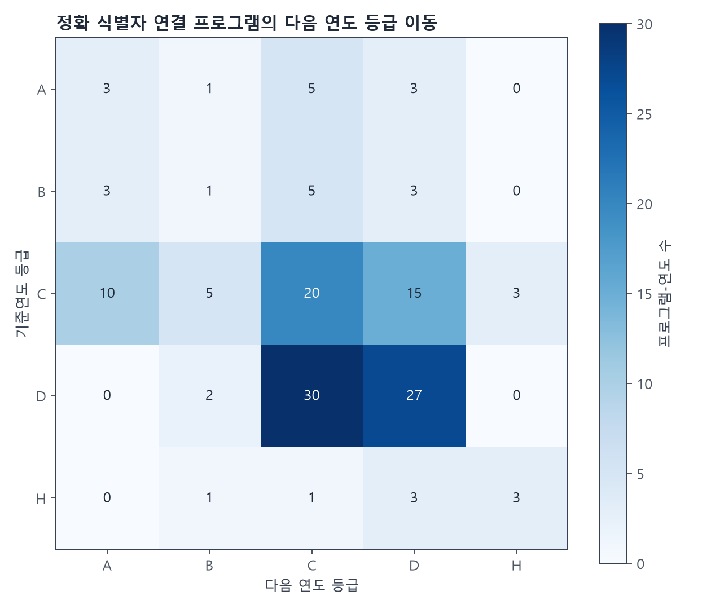

# 다음 연도 방향성 분석 보고서

## 기술 요약

2022·2023년 기준 159개 프로그램-연도 중 정확한 `program_identity_id`로 다음 연도를 연결한 표본은 144/159개입니다. 기준 A+B 중 다음 연도 동일 신호계열 관측은 14/24(58.33%), 다음 연도 A+B 유지는 8/24(33.33%)였습니다.

## 방법

2022→2023, 2023→2024만 사용했습니다. 명칭 유사도나 추정 연결은 사용하지 않았고 identity unresolved·UNKNOWN_CONTINUITY·후속연도 결측은 사유와 함께 제외했습니다. 미래자료는 기준연도 등급 판정에 입력하지 않았습니다.

## 한계

이는 다음 연도 관측과의 방향적 연관성입니다. 예측 정확도·적중률·모델 성능·인과효과·정책효과를 뜻하지 않습니다. 모든 비율은 `temporal_followup_summary.csv`에 분자와 분모를 함께 저장했습니다.
