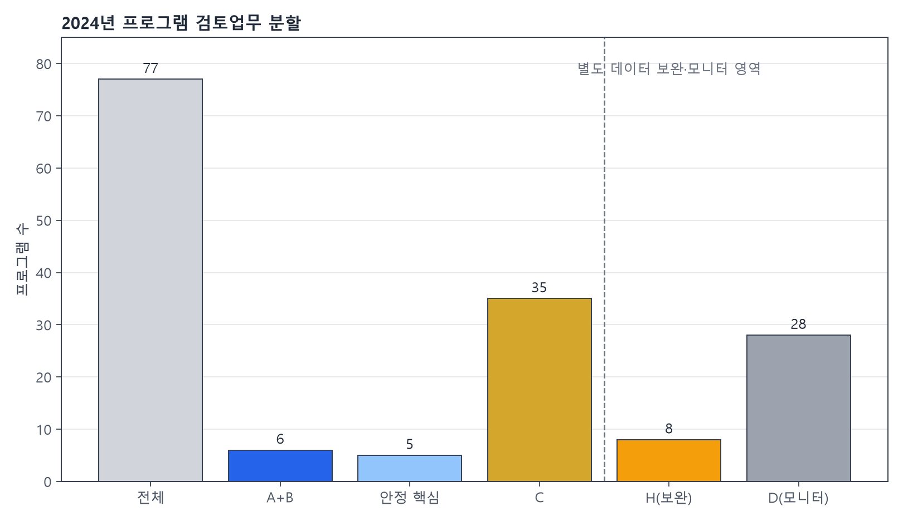

# 검토범위 압축 보고서

## 기술 요약

2024년 생산 A+B는 6/77개(7.79%)로 프로그램 검토범위를 압축합니다. 이 6개가 차지하는 본예산은 3.91%, 예산현액은 3.94%, 연결 성과지표는 7.23%, 비교가능 성과지표는 7.41%입니다.

원문 검토단위는 `candidate_id×project_id`로 연결된 2024년 1,080개 중 A+B 74개(6.85%)입니다. H의 일부 candidate는 상세사업이 연결되지 않아 잠재 원문 전체량이 아니라 실제 연결 가능한 단위만 분모로 사용했습니다.

## 등급별 규모와 예산 비중

| 등급 | 프로그램 수 | 본예산 비중 | 예산현액 비중 |
|---|---:|---:|---:|
| A | 4 | 0.34% | 0.35% |
| B | 2 | 3.57% | 3.59% |
| C | 35 | 8.50% | 8.63% |
| D | 28 | 81.84% | 82.06% |
| H | 8 | 5.75% | 5.37% |

## 안정 핵심군과 경계군

- 임계값 안정 핵심군: 5/6
- 임계값 경계군: 1/6 (`소록도병원`)
- A+B 내부 반복·복합 구조화 신호 포함: 6/6

## 해석 제한

압축률은 검토업무 분할을 뜻합니다. 문제사업 포착률·정확도·재현율이 아닙니다. H는 우선순위 축에 누적하지 않고 데이터 보완 업무로 분리했습니다.
